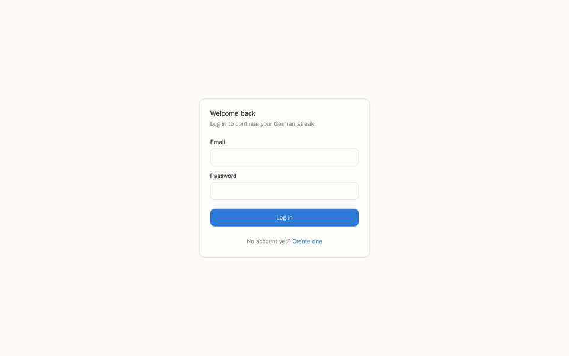

# DeutschAI

An AI-powered, adaptive platform for learning German from A1 to C1 — architected so
additional languages (Spanish, French, Japanese, …) can be added later without
reworking the core.

DeutschAI combines a spaced-repetition learning engine, a retrieval-grounded
AI tutor, a local speech and conversation practice engine, and
machine-learning-driven analytics and recommendations, served through a
FastAPI backend and a Next.js frontend. See
[`docs/FEATURES.md`](docs/FEATURES.md) for a full breakdown of platform
capabilities and [`docs/ARCHITECTURE.md`](docs/ARCHITECTURE.md) for the
technical design.

## Demo



## Features

- Email/password registration and login (JWT access + refresh tokens)
- User profile (name, CEFR level, target language)
- A dashboard that logs study sessions and computes streaks, longest streak,
  and weekly/total minutes — plus a GitHub-style heatmap of the last 12 weeks
- **Vocabulary notebook** (`/vocabulary`) with genuine SM-2 spaced repetition —
  Again/Hard/Good/Easy reviews adjust each word's ease factor and next-due date
- **Curriculum roadmap** (`/curriculum`) — the Goethe-Zertifikat A1 grammar
  syllabus + Sprechen topic list, click-to-cycle progress per topic
- **Daily planner** (`/planner`) — a LangGraph agent (deterministic nodes, no
  LLM call needed) allocates your available minutes across vocab/grammar/
  listening/speaking based on what's actually due and unmastered, cached in
  Redis per user/day
- **AI Tutor** (`/tutor`) — a RAG-grounded LangGraph agent: retrieves from a
  Qdrant knowledge base (grammar notes embedded locally with `fastembed`, no
  embedding API key needed) and generates an answer with Claude, tailored to
  your CEFR level. Requires `ANTHROPIC_API_KEY` to generate responses;
  without it, the endpoint returns a clear "not configured" message and the
  rest of the app continues to function normally
- **Practice quiz** (`/quiz`) — seeded multiple-choice questions, graded
  deterministically. A wrong answer is recorded by the Memory Agent and
  shows up as a "Recent mistakes" card on the dashboard
- **Conversation Mode** (`/conversation`) — record yourself speaking German,
  get a transcript (`faster-whisper`, local, no API key), a Claude-generated
  reply from a LangGraph Conversation Agent scoring your grammar/vocabulary,
  and a synthesized spoken reply (Piper, local, no API key). Pronunciation
  and fluency scores are derived from the STT engine's own decode signal
  (word-level confidence and timing) — heuristic proxies, not a certified
  phonetic assessment
- **Reading comprehension** (`/reading`) and **listening comprehension**
  (`/listening`) — short passages/clips with one comprehension question
  each, graded deterministically like the quiz. Listening audio is
  synthesized locally via Piper and cached in object storage
- **Writing practice** (`/writing`) — respond to a prompt in German; a
  Writing Agent (same LangGraph shape as Conversation Mode) grades grammar,
  vocabulary, and task completion via Claude, with brief feedback
- **Recommendation Engine & Analytics** (on `/dashboard`) — grammar/
  vocabulary/speaking/reading/listening/writing skill scores,
  weakest/strongest topic rankings, a progress-forecast milestone,
  habit-intelligence figures (consistency score, best study day), a
  "recommended focus" list (due vocab + weak topics), and a Motivation
  Agent banner after a study gap — computed entirely from your own
  learning history
- **Admin panel** (`/admin`, superuser-only) — user management, per-service
  reachability checks (Postgres/Redis/Qdrant/MinIO), session activity
  across all users, LLM token usage by agent, and an error log. Sentry and
  OpenTelemetry integrations activate once their respective settings
  (`SENTRY_DSN`, `OTEL_EXPORTER_OTLP_ENDPOINT`) are configured
- Continuous integration builds both backend and frontend Docker images on
  every push as a deploy-readiness check
- Dark mode
- The full local dev stack (Postgres, Redis, Qdrant, MinIO, backend, frontend,
  nginx) via one `docker compose up` — MinIO stores the recorded/synthesized
  audio blobs from Conversation Mode

## Quick start

```bash
cp .env.example .env
cp apps/backend/.env.example apps/backend/.env
cp apps/frontend/.env.example apps/frontend/.env

docker compose up --build
```

- Frontend: http://localhost:3000
- Backend API docs (Swagger): http://localhost:8000/api/v1/docs
- Through the nginx reverse proxy: http://localhost

The backend entrypoint waits for Postgres and runs Alembic migrations
automatically on container start — no manual migration step needed for a
fresh clone.

## Repository layout

```
deutschai/
├── apps/
│   ├── backend/          FastAPI + SQLAlchemy (async) + Alembic
│   └── frontend/          Next.js (App Router) + TypeScript + Tailwind + shadcn/ui
├── infra/
│   └── nginx/              Reverse proxy config
├── docs/
│   ├── ARCHITECTURE.md    Clean-architecture layering, DB schema, request flow
│   └── FEATURES.md         Platform capabilities and technology stack
├── .github/workflows/     CI (lint + test + build on every push; a deploy
│                          job builds both Docker images but pushes nowhere)
└── docker-compose.yml
```

See [`docs/ARCHITECTURE.md`](docs/ARCHITECTURE.md) for how the backend layers
fit together and [`docs/FEATURES.md`](docs/FEATURES.md) for a full breakdown
of platform capabilities.

## Development

### Backend

```bash
cd apps/backend
python -m venv .venv && source .venv/bin/activate
pip install -r requirements.txt
cp .env.example .env   # then point POSTGRES_HOST/REDIS_HOST at localhost
alembic upgrade head
python -m app.ai.rag.ingest  # embeds the knowledge base into Qdrant (needed for /tutor)
uvicorn app.main:app --reload
pytest                  # 143 tests, in-memory SQLite/Qdrant + fake Redis, no external services needed
```

### Frontend

```bash
cd apps/frontend
npm install
cp .env.example .env
npm run dev
npm run test            # Vitest unit tests
npm run test:e2e         # Playwright — requires the full stack running
```

## License

Unlicensed portfolio/demo project.
