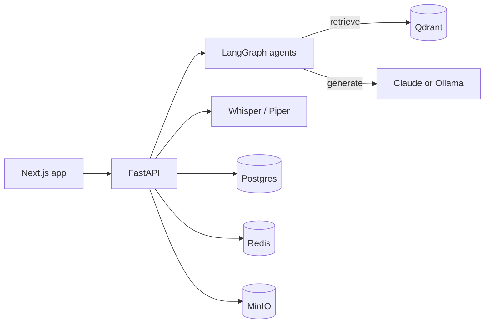

# DeutschAI

A voice and agentic-AI German tutor for beginners: it explains grammar from its own notes, holds spoken conversations, grades writing and plans daily study.

[](https://github.com/nithya-prakash/DeutschAI/actions/workflows/ci.yml)  [](LICENSE)


**Content today is A1 only.** The architecture (per-user CEFR level and target language) is built to extend to C1, but no A2-C1 content exists.

## Headline results

Tutor evaluation: 40 questions (32 in-scope A1 grammar, 8 out-of-scope), the app's own retrieval, local `qwen2.5:3b-instruct` via Ollama, rule-based metrics, no LLM judge ([method](docs/EVALUATION.md)).

| Measure | Result |
|---|---|
| Right grammar note in the top 4 retrieved chunks | 84% (27 of 32); top-1 59% |
| Answer contains every key fact (strict regex, a lower bound) | 53% (17 of 32) |
| Quoted German examples found in the retrieved text | 56% |
| Out-of-scope questions flagged as outside the notes | 0 of 8 |
| Backend tests | 146 passing |

The Claude path is implemented but has **not** been run live yet; no Claude numbers are claimed.

## Quickstart

Needs Docker with Compose v2.

```bash
git clone https://github.com/nithya-prakash/DeutschAI.git && cd DeutschAI
cp .env.example .env && cp apps/backend/.env.example apps/backend/.env && cp apps/frontend/.env.example apps/frontend/.env
docker compose up --build -d
docker compose exec backend python -m app.ai.rag.ingest    # loads the grammar notes into Qdrant
```

Open http://localhost:3000 (API docs: http://localhost:8000/api/v1/docs). Everything except the Tutor, Conversation and Writing agents works with no LLM configured. To enable them, set `ANTHROPIC_API_KEY` in `.env`, or use free local Ollama:

```
LLM_PROVIDER=openai
LLM_BASE_URL=http://host.docker.internal:11434/v1
LLM_MODEL=llama3.2
```

| Variable | Used for |
|---|---|
| `SECRET_KEY`, `POSTGRES_PASSWORD`, `MINIO_*` | the stack (local defaults in `.env.example`) |
| `ANTHROPIC_API_KEY`, `ANTHROPIC_MODEL` | Claude for the three LLM agents |
| `LLM_PROVIDER`, `LLM_BASE_URL`, `LLM_MODEL` | Ollama or any OpenAI-compatible server |
| `SENTRY_DSN`, `OTEL_EXPORTER_OTLP_ENDPOINT` | optional; unset means off |

## How it works

A Next.js app talks to a FastAPI backend (Postgres, Redis, Qdrant, MinIO). Eight agents sit behind it: the Tutor retrieves from 16 A1 grammar notes (local `fastembed` embeddings) and generates an answer for the learner's level; Conversation and Writing make one LLM call per turn that replies and scores; Planner and Recommendation are deterministic LangGraph graphs; speech is local (`faster-whisper` in, Piper out). Flows and a sequence diagram: [docs/AGENTS.md](docs/AGENTS.md).


```mermaid
graph LR
    U[Next.js app] --> A[FastAPI]
    A --> G[LangGraph agents]
    G -->|retrieve| Q[(Qdrant)]
    G -->|generate| L[Claude or Ollama]
    A --> S[Whisper / Piper]
    A --> P[(Postgres)] & R[(Redis)] & M[(MinIO)]
```

## Usage

- **Tutor** `/tutor`: ask a grammar question, get an answer with its source notes (`POST /api/v1/tutor/ask`).
- **Conversation** `/conversation`: record German, get transcript, reply, scores and spoken audio.
- **Writing** `/writing`, **quiz** `/quiz`, **reading** `/reading`, **listening** `/listening`: graded practice.
- **Vocabulary** `/vocabulary`: SM-2 spaced repetition. **Planner** `/planner`: daily plan from your due items.
- **Dashboard**: streaks, skill scores, recommendations. **Admin** `/admin`: users, service checks, LLM token usage.

```bash
# Re-run the tutor evaluation (from apps/backend, with an LLM configured)
python -m evaluation.run_tutor_eval --label my-model
```

## Limitations

- A1 content only; "A1 to C1" is a design goal, not a feature.
- The Claude path is untested live. Only Ollama has run against a real model.
- With a 3B local model the tutor invents facts and never says when a topic is outside its notes (0 of 8). Answer quality tracks the model.
- Pronunciation and fluency scores are proxies from Whisper confidence and timing, not a phonetic assessment.
- The tutor evaluation is small (40 questions), rule-based, and scored against notes this repo wrote itself. Conversation and Writing have no quality evaluation.
- No hosted deployment; CI builds the Docker images but pushes nowhere.
- Browser E2E tests (Playwright) need the full stack running.

## Repo layout

```
apps/backend/    FastAPI, SQLAlchemy, Alembic, agents (app/ai), RAG notes, tests
apps/backend/evaluation/   tutor eval set, runner, results
apps/frontend/   Next.js, TypeScript, Tailwind, Vitest, Playwright (e2e/)
infra/nginx/     reverse proxy
docs/            AGENTS.md, EVALUATION.md, ARCHITECTURE.md, FEATURES.md, details.md
docker-compose.yml, .github/workflows/ci.yml
```

## Checks

```bash
cd apps/backend && pytest                 # 146 tests, in-memory SQLite and Qdrant, no services needed
cd apps/backend && ruff check .
cd apps/frontend && npm run lint && npm run typecheck && npm run test
cd apps/frontend && npm run test:e2e      # Playwright, needs the stack running
```

CI runs backend lint and tests, frontend lint, typecheck, tests and build, then builds both images.

## Roadmap and license

Next: A2 content, a live Claude evaluation, a larger tutor evaluation set. MIT licensed ([LICENSE](LICENSE)). Full feature list: [docs/details.md](docs/details.md).
