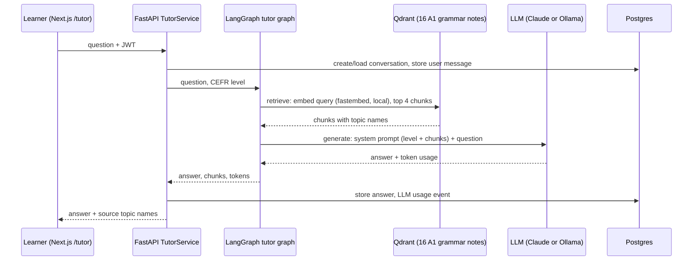
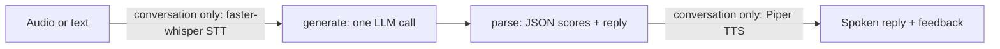

# Agent flows (LangGraph)

DeutschAI has eight agents. Five are plain LangGraph graphs; three of those call an LLM.
The agents are small, linear graphs on purpose: each node does one thing and the state
is a `TypedDict`. There is no branching, looping or tool calling in any of them.

| Agent | Graph | LLM? | Code |
|---|---|---|---|
| Tutor | retrieve → generate | yes | `app/ai/tutor_agent.py` |
| Conversation | generate → parse | yes | `app/ai/conversation_agent.py` |
| Writing | generate → parse | yes | `app/ai/writing_agent.py` |
| Planner | assess → allocate → render | no | `app/ai/planner_agent.py` |
| Recommendation | assess → rank → render | no | `app/ai/recommendation_agent.py` |
| Assessment, Memory, Motivation | plain services, no graph | no | `app/services/` |

## Tutor flow (`POST /api/v1/tutor/ask`)

Details that matter:

- **Retrieval** embeds the question with `paraphrase-multilingual-MiniLM-L12-v2` (local ONNX,
  no API key) and returns the 4 nearest chunks by cosine similarity.
- **Generation** puts the chunks in the system prompt and tells the model to say so when the
  notes do not cover the question. The prompt allows general German knowledge in that case,
  flagged as outside the app's material.
- **Provider** is chosen by `get_chat_model()`: `LLM_PROVIDER=anthropic` (default, needs
  `ANTHROPIC_API_KEY`) or `openai` (any OpenAI-compatible endpoint, e.g. local Ollama). With
  neither configured the endpoint returns HTTP 503 and the database transaction rolls back.
- **Testability**: `build_tutor_graph(chat_model)` takes the model as an argument, so unit
  tests run the real retrieval and prompt assembly against a fake model.

## Conversation and Writing flows

One LLM call per turn both continues the dialogue (or grades the essay) and scores grammar
and vocabulary as JSON; the `parse` node validates it. Pronunciation and fluency scores come
from Whisper's word confidence and timing, not from the LLM, and are heuristic proxies.

## Planner and Recommendation flows

Deterministic: `assess` reads due vocabulary and unmastered topics, `allocate` splits the
learner's minutes, `render` formats the plan (cached in Redis per user and day). The
recommendation graph ranks weak topics and due items the same way. No LLM call.
