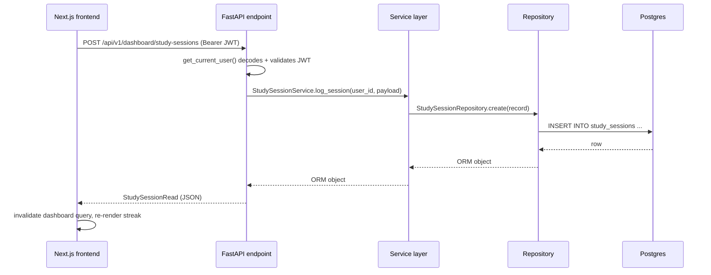
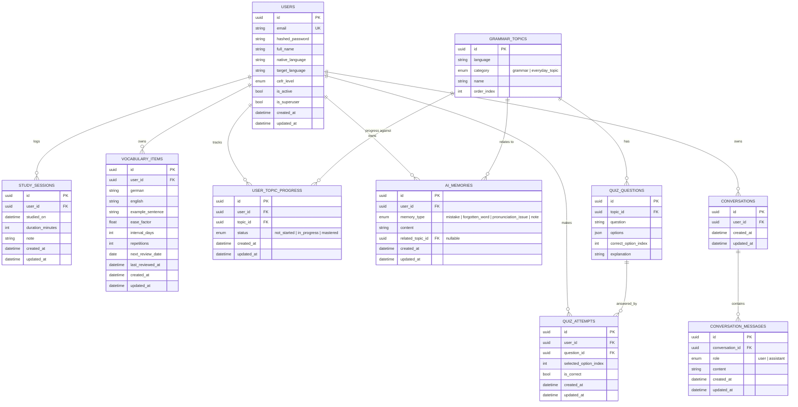
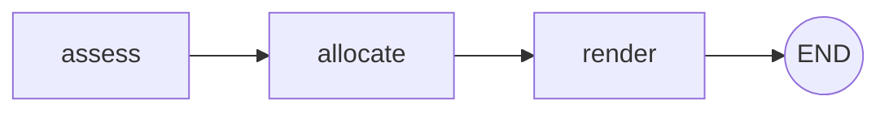
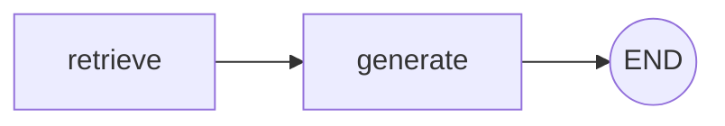

# Architecture

## Why clean architecture, here

The system has a lot of moving parts — AI agents, a RAG pipeline, a speech
engine, ML components — spanning multiple layers of the backend. The
codebase is layered so each of those stays independently testable and
swappable:

```
app/
├── api/            Transport only: HTTP request/response, status codes, DI wiring
│   └── v1/endpoints/
├── services/        Business logic — the only place that orchestrates repositories
├── repositories/    Data access — the only place that writes SQLAlchemy queries
├── ai/              Agent orchestration (LangGraph graphs) — never imports
│   │                SQLAlchemy directly; some agents are pure functions
│   │                (Planner), some genuinely call an LLM (Tutor)
│   └── rag/          Knowledge base: source docs, chunking/ingestion, retriever
├── domain/schemas/  Pydantic request/response contracts (never the ORM model itself)
├── domain/          Also holds static reference data (curriculum_reference.py) —
│                    shared by the seed migration and the test suite, one source of truth
├── models/          SQLAlchemy ORM models — persistence shape
├── infrastructure/  DB session/engine, Redis client — swappable backends
└── core/            Config, security, logging — cross-cutting, no business logic
```

Rules that keep this from rotting into a ball of mud:

- **API layer never imports SQLAlchemy.** It depends on a service; the service
  depends on a repository. Swapping Postgres for something else touches
  `repositories/` and `infrastructure/` only.
- **ORM models never cross the API boundary.** Endpoints return
  `domain/schemas/*Read` models built via `model_validate(orm_object)`.
  Adding a field to the DB doesn't silently expose it over the API.
- **Services hold business logic, repositories don't.** `DashboardService`
  computes streaks; `StudySessionRepository` only knows how to fetch rows.
- **Dependency injection via FastAPI's `Depends`.** `get_db`, `get_current_user`
  are the foundational dependencies; every agent/engine registers its own
  `Depends`-based providers rather than being imported as a global.

## Why the DB types are dialect-portable

Models use `sqlalchemy.Uuid` and `sqlalchemy.Enum` rather than
`postgresql.UUID`. That's not a style preference — it's what lets the test
suite run against in-memory SQLite (`tests/conftest.py`) while production runs
Postgres, without maintaining two schemas. Same models, two dialects, zero
duplication.

## Request flow



## Database schema



`GRAMMAR_TOPICS` is global reference data (same for every learner), seeded via
migration from `app/domain/curriculum_reference.py`. A missing
`UserTopicProgress` row means "not started" — rows are created lazily on the
first status change rather than seeding one row per topic per new user.
`QUIZ_QUESTIONS` follows the same pattern, seeded via migration from
`app/domain/quiz_reference.py`.

## The Planner Agent

`app/ai/planner_agent.py` builds a 3-node `StateGraph` (`assess → allocate →
render`) that turns `{available_minutes, vocab_due_count, weak_topic_count}`
into an ordered list of time-boxed plan blocks. Every node is a deterministic
Python function — no LLM call, no I/O. That's a deliberate choice for this
specific agent (allocating minutes across activities doesn't need generation),
not a placeholder for "real" LangGraph usage:



`PlannerService` (business logic — DB reads, Redis caching) is the only thing
that calls the graph; the graph itself never touches a database or an HTTP
request, which is what makes `generate_daily_plan()` trivially unit-testable
(see `tests/test_planner.py`) without mocking anything.

## RAG Pipeline & Tutor Agent

**Ingestion** (`app/ai/rag/ingest.py`): grammar reference notes
(`app/ai/rag/knowledge_base/*.md`, one per A1 topic) are split into
paragraph-merged chunks (≤800 chars, never splitting mid-paragraph), embedded
with `fastembed` (a local ONNX model — `paraphrase-multilingual-MiniLM-L12-v2`,
384 dims — chosen over sentence-transformers specifically to avoid a torch
dependency), and upserted into Qdrant with deterministic UUID5 point IDs so
re-running ingestion overwrites rather than duplicates.

**Retrieval** (`app/ai/rag/retriever.py`): embeds a query with the same model
and returns the top-k most similar chunks by cosine similarity.

**Generation** (`app/ai/tutor_agent.py`): a 2-node graph (`retrieve → generate`)
using `langchain-anthropic`. Unlike the Planner Agent, this one genuinely needs
generation — explaining a grammar point simply, at the right CEFR level, isn't
rule-based work — so it requires `ANTHROPIC_API_KEY`:



`build_tutor_graph(chat_model)` takes the chat model as a parameter rather
than reaching for a global, which is what makes it testable without a real
API key — `tests/test_tutor.py` passes a fake chat model and verifies
retrieval + prompt assembly, while `get_chat_model()` (the production
factory) raises `LLMNotConfiguredError` if the key is missing, caught by the
endpoint and surfaced as an HTTP 503. The DB session rolls back cleanly on
that exception, so no orphaned conversation rows are left behind.

`TutorService` wraps the graph with conversation persistence
(`conversations` / `conversation_messages`, with ownership checks) — the
graph itself stays a pure function of `(question, cefr_level) -> answer`.

## Assessment Agent & Memory Agent

Grading a multiple-choice answer is index comparison, so
`AssessmentService` stays rule-based — no LLM call, since traditional logic
suffices. A wrong answer is written to `ai_memories` via `MemoryService`,
tied to the question's topic; the "Recent mistakes" dashboard card reads
that back. `AnalyticsService` and `RecommendationService` also read
`ai_memories` counts directly for weakest/strongest topic ranking and
recommended-topic focus (see below).

## Auth

Stateless JWT (access token, 30 min; refresh token, 30 days), `HS256`,
verified in `app/api/deps.py::get_current_user`. No session storage is
needed — Redis backs the planner cache (see above), not auth.

## Frontend

- **State**: Zustand (`stores/auth-store.ts`) for auth tokens/user, persisted
  to `localStorage`. Server state (dashboard summary, profile) lives in
  TanStack Query, not Zustand — it's cache-invalidated, not manually synced.
- **Route protection**: `useRequireAuth()` redirects to `/login` client-side
  if there's no access token. (A middleware-based server-side guard remains a
  candidate for later, once there's session data worth protecting server-side.)
- **API client**: a single `apiFetch()` wrapper (`lib/api-client.ts`) attaches
  the bearer token and transparently retries once via the refresh endpoint on
  a 401, rather than every call site handling token refresh itself.

## Speech Engine & Conversation Mode

Both STT and TTS run locally — no API key, no per-request cost, same
philosophy as the RAG pipeline's `fastembed` choice:

- **STT** (`app/ai/speech/stt.py`): `faster-whisper` (CTranslate2, no torch).
  `transcribe(model, audio_bytes)` takes the model as a parameter — the same
  dependency-injection shape as `tutor_agent.build_tutor_graph` — so tests
  inject a fake model instead of loading real weights.
- **TTS** (`app/ai/speech/tts.py`): Piper, invoked via its official prebuilt
  CLI binary rather than the `piper-tts` Python package, for broader
  platform wheel support. The binary and the voice model are downloaded
  once and cached locally (`.whisper_cache/`, `.piper_cache/`), mirroring
  fastembed's download-once-then-cache pattern.
- **Object storage**: `app/infrastructure/object_store/minio_client.py`
  wraps MinIO for both the learner's uploaded recordings and the
  synthesized replies. Playback is proxied through
  `GET /speech/turns/{id}/audio` (ownership-checked, same JWT dependency as
  everything else) rather than a public presigned URL, so auth stays
  centralized.
- **Conversation Agent** (`app/ai/conversation_agent.py`): a 2-node
  LangGraph graph (`generate -> parse`) reusing `tutor_agent.get_chat_model`
  rather than a second Anthropic client factory. One Claude call per turn
  does double duty — continues the dialogue in German at the learner's CEFR
  level, and scores the grammar/vocabulary of what they just said, returned
  as JSON. If the model's output doesn't parse as valid JSON, the `parse`
  node falls back to the raw text as the reply, with scores left `None`.
- Pronunciation and fluency scores come from the STT wrapper instead of
  Claude, since Claude only ever sees text: `app/ai/speech/stt.py` derives
  them from `faster-whisper`'s own decode signal — mean word-level
  confidence for pronunciation, speaking rate and inter-word pause gaps for
  fluency. Both are documented as heuristic proxies, not a certified
  phonetic or fluency assessment.
- `speech_conversations`/`speech_turns` are separate tables from
  `conversations`/`conversation_messages` (the Tutor Agent's text threads):
  different content shape (audio blobs, scores) and a different agent.

## Recommendation Engine, ML & Analytics

Every metric here is computed from data the platform already collects — no
dedicated tables are needed. `app/ai/ml/` holds the pure-function models (no
DB, no LLM, unit-testable in isolation):

- **Forgetting curve** (`forgetting_curve.py`): Ebbinghaus-style exponential
  decay (`R = e^(-t/S)`) over a vocab item's existing SM-2 state (ease
  factor, interval, days since last review). `days_since()` normalizes a
  DB-sourced timestamp before subtracting from "now": SQLite (the test
  suite's engine) hands back naive datetimes even for `DateTime(timezone=
  True)` columns, while Postgres preserves tzinfo — a naive value is
  treated as UTC rather than left to raise.
- **Habit Intelligence** (`habit_model.py`): a recency-weighted consistency
  score, a day-of-week/recent-trend blend for skip probability, and a
  best-study-*day* detector — weighted statistics computed from
  `StudySession` history. Best study *day* rather than *hour*: `studied_on`
  has no reliable per-user timezone behind it (no timezone field on
  `User`), so reporting an hour would risk being actively misleading.
- **Forecasting** (`forecasting.py`): a least-squares trend fit over
  cumulative topics-mastered-over-time, extrapolated to a projected
  completion date. Returns `None` on fewer than 2 distinct data points, a
  flat/negative trend, or an already-complete curriculum.
- **Recommendation Agent** (`app/ai/recommendation_agent.py`): a 3-node
  LangGraph graph (`assess -> rank -> render`), the same shape as
  `planner_agent.py` — ranking pre-fetched candidates by a precomputed score
  doesn't need generation, so every node is deterministic.
  `RecommendationService` builds candidates from reviewed vocabulary
  (retention-scored) and non-mastered topics with recorded mistakes;
  podcasts and articles are out of scope, since there's no external content
  source integrated yet (see `FEATURES.md`'s Future Work).
- **Motivation Agent** (`app/services/motivation_service.py`): deterministic
  message templates bucketed by days-since-last-session, not an LLM call —
  the message space is small and bounded, so a rule picks a canned message.
  Every message pairs encouragement with a smaller suggested-minutes
  figure, shown as a suggestion the learner can override in the Planner,
  not something that silently mutates `PlannerService`'s output.
- **`AnalyticsService`** composes all of the above into `DashboardSummary`'s
  fields (skill scores, topic rankings, forecast, consistency, at-risk
  vocab count); `DashboardService.get_summary` also calls
  `MotivationService` and is the single place `/dashboard/summary` reads
  from. It fetches `StudySession` history over a wide 365-day window
  (`DATA_FETCH_DAYS`) rather than the display-only 12-week window, so
  habit-intelligence and motivation calculations see the learner's actual
  full history.
- **Reading/Listening comprehension** (`app/services/reading_service.py`,
  `app/services/listening_service.py`): deterministic MCQ grading, same
  shape as the Assessment Agent's quiz grading — a wrong answer is recorded
  as a Memory Agent mistake. Listening content is synthesized once via the
  existing local Piper TTS wrapper and cached in object storage
  (`app/ai/speech/synthesize_listening_audio.py` pre-synthesizes eagerly;
  `ListeningService.get_audio` self-heals by synthesizing on first request
  if that step was skipped).
- **Writing exercise** (`app/ai/writing_agent.py`,
  `app/services/writing_service.py`): the same LLM-graded LangGraph shape as
  the Conversation Agent — one Claude call grades grammar, vocabulary, and
  task completion, with the submitted text persisted before grading so it's
  durable even if grading itself fails.
- `LOCKED_INSIGHTS` is empty now that grammar, vocabulary, speaking,
  reading, listening, and writing all have a real exercise/signal behind
  them — kept as a list (not removed) so a future genuinely-locked insight
  has somewhere to go.

## Monitoring, CI/CD & Admin Panel

**Observability** (`app/main.py`): Sentry and OpenTelemetry are each gated
behind their own optional setting (`SENTRY_DSN`, `OTEL_EXPORTER_OTLP_ENDPOINT`
in `core/config.py`) — unset means inactive, consistent with how
`ANTHROPIC_API_KEY` is handled. OpenTelemetry is skipped entirely rather
than initialized with a no-op exporter when unset, since instrumenting
spans with nowhere to send them adds no value. Prometheus/Grafana
dashboards are a candidate for a future pass once there's production
traffic to chart.

A global exception handler (`app/main.py`) catches unhandled errors, logs
them, and persists an `ErrorLogEntry` row via the same overridable `get_db`
dependency the rest of the app uses. This is intentionally not a Sentry-API
proxy: reading issues back from Sentry needs a second credential distinct
from `SENTRY_DSN` and would largely re-implement Sentry's own dashboard.
Sentry still receives the same exceptions independently via its own ASGI
integration — the local table is a simpler, dependency-free view for the
admin panel.

**LLM usage tracking**: `TutorState`/`ConversationTurnState` (the Tutor and
Conversation agents' LangGraph state) each carry `input_tokens`/
`output_tokens`, read from `response.usage_metadata` inside the existing
`_generate` node — the graphs themselves stay DB-free, the same pattern
`grammar_score` uses in `conversation_agent.py`. `TutorService` and
`SpeechService` (which already hold a DB session) persist an
`LLMUsageEvent` row after each real call.

**Admin panel** (`/admin`, `app/services/admin_service.py`): gated on
`get_current_superuser` (`app/api/deps.py`). Real per-service reachability
checks (Postgres via `SELECT 1`, Redis via `PING`, Qdrant via
`get_collections()`, MinIO via `bucket_exists`), session activity
aggregated across all users (`StudySessionRepository.list_all_since`,
distinct from the per-user `list_for_user_since` the dashboard uses), LLM
token counts by agent, and the error log above. "Sessions" here means
`StudySession` activity — the only session concept this app has, since auth
is stateless JWT with no server-side session table.

**CI/CD** (`.github/workflows/ci.yml`): a `deploy` job builds both Docker
images on every push to `main` to validate they remain deployable, without
pushing to a registry. Deploying to a production target remains a separate,
deliberate decision (see `FEATURES.md`'s Future Work).
