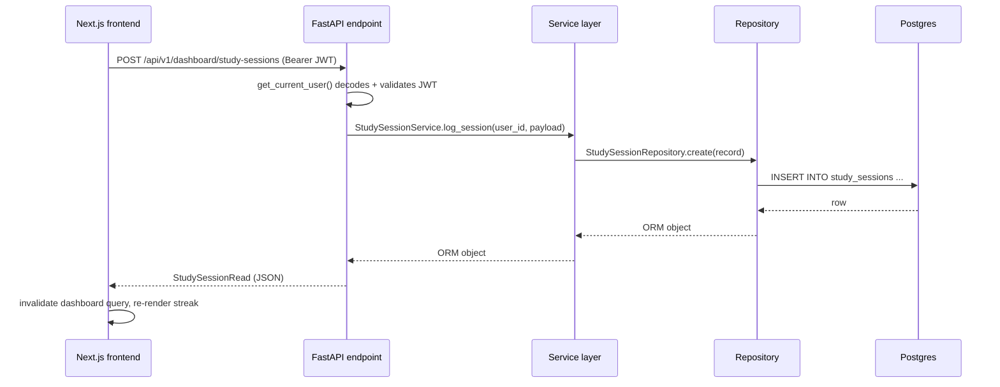
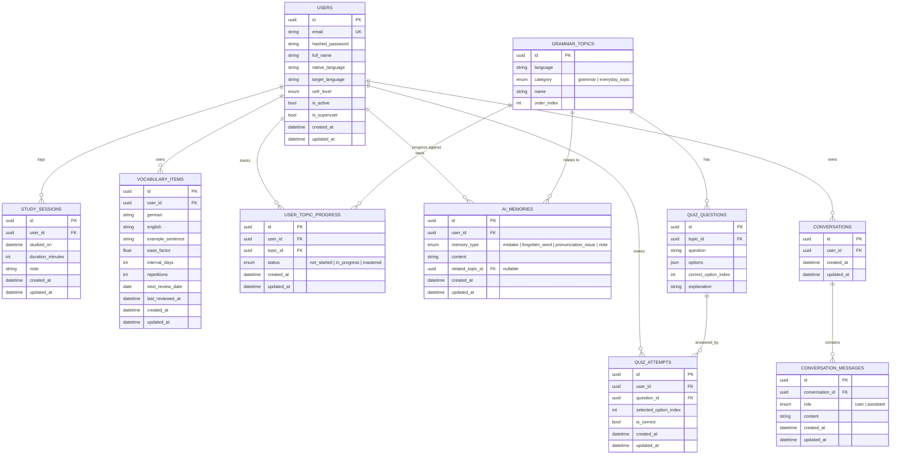
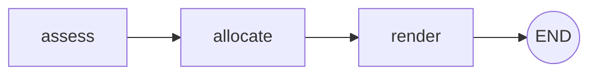
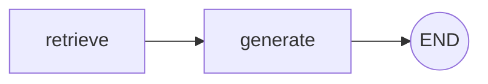

# Architecture (Phase 6)

## Why clean architecture, here

The eventual system has a lot of moving parts (AI agents, RAG, speech, ML
models) that don't exist yet. The backend is layered so that adding them later
means adding new modules, not rewriting existing ones:

```
app/
├── api/            Transport only: HTTP request/response, status codes, DI wiring
│   └── v1/endpoints/
├── services/        Business logic — the only place that orchestrates repositories
├── repositories/    Data access — the only place that writes SQLAlchemy queries
├── ai/              Agent orchestration (LangGraph graphs) — never imports
│   │                SQLAlchemy directly; some agents are pure functions
│   │                (Planner), some genuinely call an LLM (Tutor)
│   └── rag/          Knowledge base: source docs, chunking/ingestion, retriever
├── domain/schemas/  Pydantic request/response contracts (never the ORM model itself)
├── domain/          Also holds static reference data (curriculum_reference.py) —
│                    shared by the seed migration and the test suite, one source of truth
├── models/          SQLAlchemy ORM models — persistence shape
├── infrastructure/  DB session/engine, Redis client — swappable backends
└── core/            Config, security, logging — cross-cutting, no business logic
```

Rules that keep this from rotting into a ball of mud:

- **API layer never imports SQLAlchemy.** It depends on a service; the service
  depends on a repository. Swapping Postgres for something else touches
  `repositories/` and `infrastructure/` only.
- **ORM models never cross the API boundary.** Endpoints return
  `domain/schemas/*Read` models built via `model_validate(orm_object)`.
  Adding a field to the DB doesn't silently expose it over the API.
- **Services hold business logic, repositories don't.** `DashboardService`
  computes streaks; `StudySessionRepository` only knows how to fetch rows.
- **Dependency injection via FastAPI's `Depends`.** `get_db`, `get_current_user`
  are the only two dependencies right now; new agents/engines register their
  own `Depends`-based providers rather than being imported as globals.

## Why the DB types are dialect-portable

Models use `sqlalchemy.Uuid` and `sqlalchemy.Enum` rather than
`postgresql.UUID`. That's not a style preference — it's what lets the test
suite run against in-memory SQLite (`tests/conftest.py`) while production runs
Postgres, without maintaining two schemas. Same models, two dialects, zero
duplication.

## Request flow (Phase 1)



## Database schema (Phase 1 + 2 + 3)



`GRAMMAR_TOPICS` is global reference data (same for every learner), seeded via
the Phase 2 migration from `app/domain/curriculum_reference.py`. A missing
`UserTopicProgress` row means "not started" — rows are created lazily on the
first status change rather than seeding 26 rows per new user. `QUIZ_QUESTIONS`
follows the same pattern, seeded via the Phase 3 migration from
`app/domain/quiz_reference.py`.

## The Planner Agent (Phase 2's first LangGraph agent)

`app/ai/planner_agent.py` builds a 3-node `StateGraph` (`assess → allocate →
render`) that turns `{available_minutes, vocab_due_count, weak_topic_count}`
into an ordered list of time-boxed plan blocks. Every node is a deterministic
Python function — no LLM call, no I/O. That's a deliberate choice for this
specific agent (allocating minutes across activities doesn't need generation),
not a placeholder for "real" LangGraph usage:



`PlannerService` (business logic — DB reads, Redis caching) is the only thing
that calls the graph; the graph itself never touches a database or an HTTP
request, which is what makes `generate_daily_plan()` trivially unit-testable
(see `tests/test_planner.py`) without mocking anything.

## RAG pipeline + Tutor Agent (Phase 3's first LLM-backed agent)

**Ingestion** (`app/ai/rag/ingest.py`): 16 original grammar notes
(`app/ai/rag/knowledge_base/*.md`, one per A1 topic) are split into
paragraph-merged chunks (≤800 chars, never splitting mid-paragraph), embedded
with `fastembed` (a local ONNX model — `paraphrase-multilingual-MiniLM-L12-v2`,
384 dims — chosen over sentence-transformers specifically to avoid a torch
dependency), and upserted into Qdrant with deterministic UUID5 point IDs so
re-running ingestion overwrites rather than duplicates.

**Retrieval** (`app/ai/rag/retriever.py`): embeds a query with the same model
and returns the top-k most similar chunks by cosine similarity.

**Generation** (`app/ai/tutor_agent.py`): a 2-node graph (`retrieve → generate`)
using `langchain-anthropic`. Unlike the Planner Agent, this one genuinely needs
generation — explaining a grammar point simply, at the right CEFR level, isn't
rule-based work — so it requires `ANTHROPIC_API_KEY`:



`build_tutor_graph(chat_model)` takes the chat model as a parameter rather
than reaching for a global, which is what makes it testable without a real
API key — `tests/test_tutor.py` passes a fake chat model and verifies
retrieval + prompt assembly for real, while `get_chat_model()` (the
production factory) raises `LLMNotConfiguredError` if the key is missing,
caught by the endpoint and surfaced as an honest HTTP 503 — checked in this
repo's own verification pass that this leaves no orphaned conversation rows
behind (the DB session rolls back cleanly on the exception).

`TutorService` wraps the graph with conversation persistence
(`conversations` / `conversation_messages`, with ownership checks) — the
graph itself stays a pure function of `(question, cefr_level) -> answer`.

## Assessment Agent + Memory Agent

Grading a multiple-choice answer is index comparison, so
`AssessmentService` stays rule-based — no LLM call, matching the platform
brief's own instruction not to reach for one where traditional logic
suffices. A wrong answer is written to `ai_memories` via `MemoryService`,
tied to the question's topic; the "Recent mistakes" dashboard card reads
that back. Phase 5's `AnalyticsService` and `RecommendationService` are the
deeper use of these memories this docstring used to describe as a future
extension — weakest/strongest topic ranking and recommended-topic focus
both read `ai_memories` counts directly (see below).

## Auth

Stateless JWT (access token, 30 min; refresh token, 30 days), `HS256`,
verified in `app/api/deps.py::get_current_user`. No session storage
needed — Redis is used for the planner cache (see above), not auth; a
background job queue (rq/arq) is still pending, deferred until there's an
actual async job to run.

## Frontend

- **State**: Zustand (`stores/auth-store.ts`) for auth tokens/user, persisted
  to `localStorage`. Server state (dashboard summary, profile) lives in
  TanStack Query, not Zustand — it's cache-invalidated, not manually synced.
- **Route protection**: `useRequireAuth()` redirects to `/login` client-side
  if there's no access token. (A middleware-based server-side guard remains a
  candidate for later, once there's session data worth protecting server-side.)
- **API client**: a single `apiFetch()` wrapper (`lib/api-client.ts`) attaches
  the bearer token and transparently retries once via the refresh endpoint on
  a 401, rather than every call site handling token refresh itself.

## Speech engine + Conversation Mode (Phase 4)

Both STT and TTS run locally — no API key, no per-request cost, same
philosophy as the RAG pipeline's `fastembed` choice:

- **STT** (`app/ai/speech/stt.py`): `faster-whisper` (CTranslate2, no torch).
  `transcribe(model, audio_bytes)` takes the model as a parameter — same
  DI-for-testability shape as `tutor_agent.build_tutor_graph` — so tests
  inject a fake model instead of loading real weights.
- **TTS** (`app/ai/speech/tts.py`): Piper, but via its official prebuilt CLI
  binary rather than the `piper-tts` Python package — that package's native
  `piper-phonemize` dependency publishes no Linux ARM64 wheel, which this
  backend's Docker image needs on Apple Silicon. The binary and the
  `de_DE-thorsten-medium` voice model are downloaded once and cached
  locally (`.whisper_cache/`, `.piper_cache/`), mirroring fastembed's
  download-once-then-cache pattern.
- **Object storage**: `app/infrastructure/object_store/minio_client.py`
  wraps MinIO (finally in use — provisioned since Phase 1, idle until now)
  for both the learner's uploaded recordings and the synthesized replies.
  Playback is proxied through `GET /speech/turns/{id}/audio`
  (ownership-checked, same JWT dependency as everything else) rather than a
  public presigned URL, so auth stays centralized.
- **Conversation Agent** (`app/ai/conversation_agent.py`): a 2-node
  LangGraph graph (`generate -> parse`) reusing `tutor_agent.get_chat_model`
  rather than a second Anthropic client factory. One Claude call per turn
  does double duty — continues the dialogue in German at the learner's CEFR
  level, and scores the grammar/vocabulary of what they just said, returned
  as JSON. If Claude's output doesn't parse, the `parse` node falls back to
  the raw text as the reply with scores left `None` — an honest gap, not a
  fabricated number.
- **Pronunciation/fluency are not scored at all**: Claude has no audio
  input, so there's no real signal for either. The API never sends these
  fields; the frontend renders them as locked (`LockedInsights`, same
  component the dashboard uses) rather than inventing something plausible.
- `speech_conversations`/`speech_turns` are separate tables from
  `conversations`/`conversation_messages` (the Tutor Agent's text threads):
  different content shape (audio blobs, scores) and a different agent.

## Recommendation Engine, ML, Analytics (Phase 5)

Everything here is computed from data Phases 1-4 already collect — **no new
DB tables, no migration**. `app/ai/ml/` holds the pure-function models (no
DB, no LLM, unit-testable in isolation):

- **Forgetting curve** (`forgetting_curve.py`): Ebbinghaus-style exponential
  decay (`R = e^(-t/S)`) over a vocab item's *existing* SM-2 state (ease
  factor, interval, days since last review) — no dedicated review-history
  table needed, since that state already encodes how well-learned a word is.
  `days_since()` normalizes a DB-sourced timestamp before subtracting from
  "now": SQLite (the test suite's engine) hands back naive datetimes even
  for `DateTime(timezone=True)` columns, while Postgres preserves tzinfo —
  a naive value is treated as UTC rather than left to raise.
- **Habit Intelligence** (`habit_model.py`): a recency-weighted consistency
  score, a day-of-week/recent-trend blend for skip probability, and a
  best-study-*day* detector — real weighted statistics from `StudySession`
  history, not a hardcoded "N skips = at risk" threshold. Best study *day*
  rather than *hour*: `studied_on` has no reliable per-user timezone behind
  it (no timezone field on `User`), so reporting an hour would risk being
  actively misleading, not just imprecise.
- **Forecasting** (`forecasting.py`): a hand-rolled least-squares trend on
  cumulative topics-mastered-over-time, extrapolated to a projected
  completion date — deliberately not a heavier model; with only a handful
  of mastery-date points per user, anything fancier would be overfitting
  noise. Returns `None` on fewer than 2 distinct dates, a flat/negative
  trend, or an already-complete curriculum.
- **Recommendation Agent** (`app/ai/recommendation_agent.py`): a 3-node
  LangGraph graph (`assess -> rank -> render`), the same shape as
  `planner_agent.py` and for the same reason — ranking pre-fetched
  candidates by a real, precomputed score doesn't need generation, so every
  node is deterministic. `RecommendationService` builds candidates from
  reviewed vocab (retention-scored) and non-mastered topics with recorded
  mistakes; **podcasts/articles are out of scope** — there's no real
  external content source wired up anywhere in the app, and inventing
  external URLs isn't something this build does.
- **Motivation Agent** (`app/services/motivation_service.py`): deterministic
  message templates bucketed by days-since-last-session, not an LLM call —
  the message space is small and bounded, so a rule picks a canned,
  non-guilt-tripping message. Always "reduce and re-invite": every message
  pairs encouragement with a *smaller* suggested-minutes figure, shown as a
  suggestion the learner can still override in the Planner, not something
  that silently mutates `PlannerService`'s output.
- **`AnalyticsService`** composes all of the above into `DashboardSummary`'s
  new fields (skill scores, topic rankings, forecast, consistency, at-risk
  vocab count); `DashboardService.get_summary` also calls
  `MotivationService` and is the single place `/dashboard/summary` reads
  from. It fetches `StudySession` history once over a wide window (365
  days, `DATA_FETCH_DAYS`) rather than the display-only 12-week window, so
  the Motivation Agent sees the learner's *actual* last session — a bug
  caught during this phase's own verification: a learner who last studied
  four months ago was incorrectly getting no motivation message at all
  because their last session fell outside a too-narrow fetch window.
- `LOCKED_INSIGHTS` shrank to just what's genuinely still missing
  platform-wide: listening/reading/writing scores (no exercise anywhere in
  the app tests any of those three yet). Grammar/vocabulary/speaking moved
  out of the locked list since Phase 5 made them real.

## Monitoring, CI/CD, admin panel (Phase 6)

**Observability** (`app/main.py`): Sentry and OpenTelemetry are each gated
behind their own optional setting (`SENTRY_DSN`, `OTEL_EXPORTER_OTLP_ENDPOINT`
in `core/config.py`) — unset means quietly absent, the same pattern
`ANTHROPIC_API_KEY` already established. OTel is skipped entirely rather
than initialized with a no-op exporter when unset, since instrumenting
spans with nowhere real to send them would just be decorative. Prometheus
and Grafana are out of scope for now — no real production traffic yet to
make dashboards meaningful.

A global exception handler (`app/main.py`) catches unhandled errors,
logs them, and persists a real `ErrorLogEntry` row via the same overridable
`get_db` dependency the rest of the app uses (so the test suite's DB
override applies to it too, rather than it silently writing to a different
database). This is deliberately *not* a Sentry-API proxy: reading issues
back from Sentry needs a second credential distinct from `SENTRY_DSN` and
would mostly re-implement Sentry's own dashboard. Sentry still receives the
same exceptions independently via its own ASGI integration — the local
table is a simpler, complementary, no-extra-dependency view for the admin
panel.

**LLM usage tracking**: `TutorState`/`ConversationTurnState` (the Tutor and
Conversation agents' LangGraph state) each gained `input_tokens`/
`output_tokens`, read from `response.usage_metadata` inside the existing
`_generate` node — the graphs themselves stay DB-free, exactly like
`grammar_score` already worked in `conversation_agent.py`. `TutorService`
and `SpeechService` (which already hold a DB session) persist an
`LLMUsageEvent` row after each real call. Fake chat models in tests don't
set `usage_metadata`, so `getattr(response, "usage_metadata", None) or {}`
defaults cleanly to 0 there — a correct default, not a masked failure.

**Admin panel** (`/admin`, `app/services/admin_service.py`): gated on
`get_current_superuser` (`app/api/deps.py`) — the first real use of
`is_superuser` anywhere in the codebase. Real per-service reachability
checks (Postgres via `SELECT 1`, Redis via `PING`, Qdrant via
`get_collections()`, MinIO via `bucket_exists`), real session activity
aggregated across all users (`StudySessionRepository.list_all_since`, distinct
from the per-user `list_for_user_since` the dashboard uses), real LLM token
counts (empty until there's a configured key and real calls), and the local
error log above. "Sessions" here means `StudySession` activity — the only
session concept this app has, since auth is stateless JWT with no
server-side session table.

**CI/CD** (`.github/workflows/ci.yml`): a `deploy` job builds both Docker
images on every push to `main` (previously nothing validated the Dockerfiles
still build) but pushes nothing anywhere — no registry, no secrets, no
cloud account. A real deployment target is a separate, explicit decision
the user opted to defer this phase, not a side effect of the pipeline
existing.

## What's deliberately not built yet

Podcast/article recommendations, a background job queue (rq/arq),
Prometheus/Grafana dashboards, and a real production deployment target are
**not** stubbed with fake logic — they're absent, not filled with
placeholder numbers or invented content.
