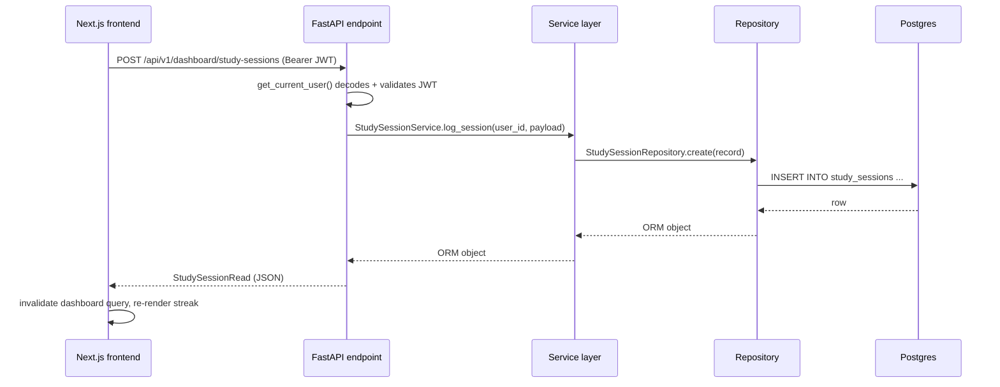
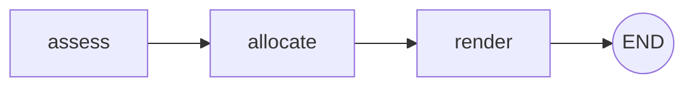
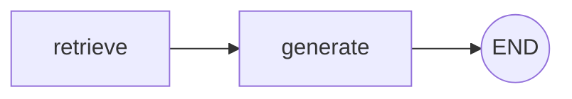

# Architecture (Phase 3)

## Why clean architecture, here

The eventual system has a lot of moving parts (AI agents, RAG, speech, ML
models) that don't exist yet. The backend is layered so that adding them later
means adding new modules, not rewriting existing ones:

```
app/
├── api/            Transport only: HTTP request/response, status codes, DI wiring
│   └── v1/endpoints/
├── services/        Business logic — the only place that orchestrates repositories
├── repositories/    Data access — the only place that writes SQLAlchemy queries
├── ai/              Agent orchestration (LangGraph graphs) — never imports
│   │                SQLAlchemy directly; some agents are pure functions
│   │                (Planner), some genuinely call an LLM (Tutor)
│   └── rag/          Knowledge base: source docs, chunking/ingestion, retriever
├── domain/schemas/  Pydantic request/response contracts (never the ORM model itself)
├── domain/          Also holds static reference data (curriculum_reference.py) —
│                    shared by the seed migration and the test suite, one source of truth
├── models/          SQLAlchemy ORM models — persistence shape
├── infrastructure/  DB session/engine, Redis client — swappable backends
└── core/            Config, security, logging — cross-cutting, no business logic
```

Rules that keep this from rotting into a ball of mud:

- **API layer never imports SQLAlchemy.** It depends on a service; the service
  depends on a repository. Swapping Postgres for something else touches
  `repositories/` and `infrastructure/` only.
- **ORM models never cross the API boundary.** Endpoints return
  `domain/schemas/*Read` models built via `model_validate(orm_object)`.
  Adding a field to the DB doesn't silently expose it over the API.
- **Services hold business logic, repositories don't.** `DashboardService`
  computes streaks; `StudySessionRepository` only knows how to fetch rows.
- **Dependency injection via FastAPI's `Depends`.** `get_db`, `get_current_user`
  are the only two dependencies right now; new agents/engines register their
  own `Depends`-based providers rather than being imported as globals.

## Why the DB types are dialect-portable

Models use `sqlalchemy.Uuid` and `sqlalchemy.Enum` rather than
`postgresql.UUID`. That's not a style preference — it's what lets the test
suite run against in-memory SQLite (`tests/conftest.py`) while production runs
Postgres, without maintaining two schemas. Same models, two dialects, zero
duplication.

## Request flow (Phase 1)



## Database schema (Phase 1 + 2 + 3)


`GRAMMAR_TOPICS` is global reference data (same for every learner), seeded via
the Phase 2 migration from `app/domain/curriculum_reference.py`. A missing
`UserTopicProgress` row means "not started" — rows are created lazily on the
first status change rather than seeding 26 rows per new user. `QUIZ_QUESTIONS`
follows the same pattern, seeded via the Phase 3 migration from
`app/domain/quiz_reference.py`.

## The Planner Agent (Phase 2's first LangGraph agent)

`app/ai/planner_agent.py` builds a 3-node `StateGraph` (`assess → allocate →
render`) that turns `{available_minutes, vocab_due_count, weak_topic_count}`
into an ordered list of time-boxed plan blocks. Every node is a deterministic
Python function — no LLM call, no I/O. That's a deliberate choice for this
specific agent (allocating minutes across activities doesn't need generation),
not a placeholder for "real" LangGraph usage:



`PlannerService` (business logic — DB reads, Redis caching) is the only thing
that calls the graph; the graph itself never touches a database or an HTTP
request, which is what makes `generate_daily_plan()` trivially unit-testable
(see `tests/test_planner.py`) without mocking anything.

## RAG pipeline + Tutor Agent (Phase 3's first LLM-backed agent)

**Ingestion** (`app/ai/rag/ingest.py`): 16 original grammar notes
(`app/ai/rag/knowledge_base/*.md`, one per A1 topic) are split into
paragraph-merged chunks (≤800 chars, never splitting mid-paragraph), embedded
with `fastembed` (a local ONNX model — `paraphrase-multilingual-MiniLM-L12-v2`,
384 dims — chosen over sentence-transformers specifically to avoid a torch
dependency), and upserted into Qdrant with deterministic UUID5 point IDs so
re-running ingestion overwrites rather than duplicates.

**Retrieval** (`app/ai/rag/retriever.py`): embeds a query with the same model
and returns the top-k most similar chunks by cosine similarity.

**Generation** (`app/ai/tutor_agent.py`): a 2-node graph (`retrieve → generate`)
using `langchain-anthropic`. Unlike the Planner Agent, this one genuinely needs
generation — explaining a grammar point simply, at the right CEFR level, isn't
rule-based work — so it requires `ANTHROPIC_API_KEY`:



`build_tutor_graph(chat_model)` takes the chat model as a parameter rather
than reaching for a global, which is what makes it testable without a real
API key — `tests/test_tutor.py` passes a fake chat model and verifies
retrieval + prompt assembly for real, while `get_chat_model()` (the
production factory) raises `LLMNotConfiguredError` if the key is missing,
caught by the endpoint and surfaced as an honest HTTP 503 — checked in this
repo's own verification pass that this leaves no orphaned conversation rows
behind (the DB session rolls back cleanly on the exception).

`TutorService` wraps the graph with conversation persistence
(`conversations` / `conversation_messages`, with ownership checks) — the
graph itself stays a pure function of `(question, cefr_level) -> answer`.

## Assessment Agent + Memory Agent

Grading a multiple-choice answer is index comparison, so
`AssessmentService` stays rule-based — no LLM call, matching the platform
brief's own instruction not to reach for one where traditional logic
suffices. A wrong answer is written to `ai_memories` via `MemoryService`,
tied to the question's topic; the "Recent mistakes" dashboard card reads
that back. Deeper use of these memories — e.g. feeding the Planner Agent's
weak-topic weighting — is a natural Phase 5 extension, not built yet (there's
no usage data yet to tune it against).

## Auth

Stateless JWT (access token, 30 min; refresh token, 30 days), `HS256`,
verified in `app/api/deps.py::get_current_user`. No session storage
needed — Redis is used for the planner cache (see above), not auth; a
background job queue (rq/arq) is still pending, deferred until there's an
actual async job to run.

## Frontend

- **State**: Zustand (`stores/auth-store.ts`) for auth tokens/user, persisted
  to `localStorage`. Server state (dashboard summary, profile) lives in
  TanStack Query, not Zustand — it's cache-invalidated, not manually synced.
- **Route protection**: `useRequireAuth()` redirects to `/login` client-side
  if there's no access token. (A middleware-based server-side guard remains a
  candidate for later, once there's session data worth protecting server-side.)
- **API client**: a single `apiFetch()` wrapper (`lib/api-client.ts`) attaches
  the bearer token and transparently retries once via the refresh endpoint on
  a 401, rather than every call site handling token refresh itself.

## What's deliberately not built yet

Whisper STT/TTS, the recommendation engine, the ML forgetting-curve/habit
models, and the Motivation Agent are **not** stubbed with fake logic —
they're absent, and the dashboard says so via `locked_insights` rather than
fabricating numbers. Building a hollow interface for them now would cost real
effort and communicate false progress; see `ROADMAP.md` for when each lands.
